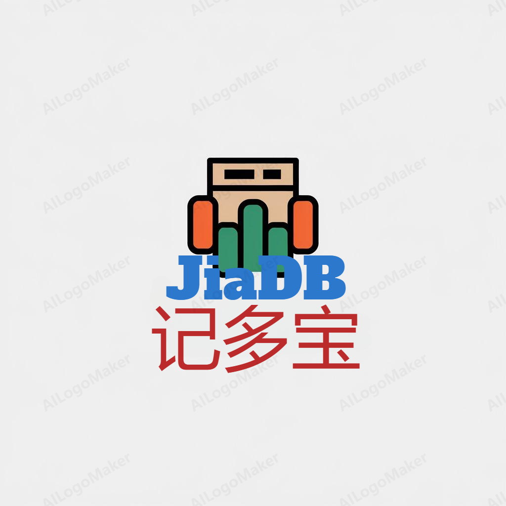

# 记多宝

## 内容目录
- [概况](#概况)
- [关键功能计划](#关键功能计划)
- [联系我们](#联系我们)
- [贡献者名单](#贡献者名单)
- [License](#license)
- [常见问题解答](#常见问题解答)

## 概况

记多宝提供全面的记账解决方案，支持多平台同步，云端加密存储，确保数据安全。智能分类，一键导入银行流水，自动校验，简化记账流程。预算管理，资产负债分析，图表可视化，让财务管理更直观。支持多人账本合并，短期重复性支出与长期成本均摊，让每一笔支出都清晰明了。立即体验，开启您的智能财务管理之旅。:sparkles:

## 关键功能计划

### 数据存储
- 支持单机，云端存储。

### 数据加密
- 用户数据，账目数据加密存储。

### 数据备份
- 数据支持备份，导出数据库文件，excel文件，txt等。

### 用户管理
- 多用户支持，支持数据隔离和融合。

### 账目记录
- 记账支持时间，类别，地点，自定义字段。
- 生成消费物品清单。
  > 在记账的同时生成物品清单，可以按照类别、金额自定义哪些情况可以生成物品清单，物品清单可以看到使用了多少天或多少个月。
- 消费类型自动分类（可以人工纠正）。

### 平台支持
- Android
- IOS
- WEB
- PC

### 账目查询
- 账目数据全文索引搜索。
- 多账本合并查看。
  > 多个人的账本支持合并查看。
- 消费支出标签（短期重复性支出/长期可均摊成本支持）。
  > 希望消费支出可以有这种属性“短期重复性支出”/“长期可均摊成本支持”（这样花起钱来有个由头，也不会太心疼）。

### 数据可视化
- 支持常见数据图表。
- 总资产、总负债、净资产变动趋势图。
  > 先期可以只做净资产趋势图。

### 数据集成
- 流水导入
  > 希望导入微信/支付宝/招商银行(这个是pdf有点难度) 月度流水的导入，最好能够自动根据一些判断规则，对支出和收入做唯一性校验。
- 移动端消费监听
  > 能监控安卓(/ios是否考虑？)页面，识别到打款成功的订单页，能自动识别，再记录。

## 联系我们
TBD

## 贡献者名单
TBD

## License
TBD

## 常见问题解答

TBD